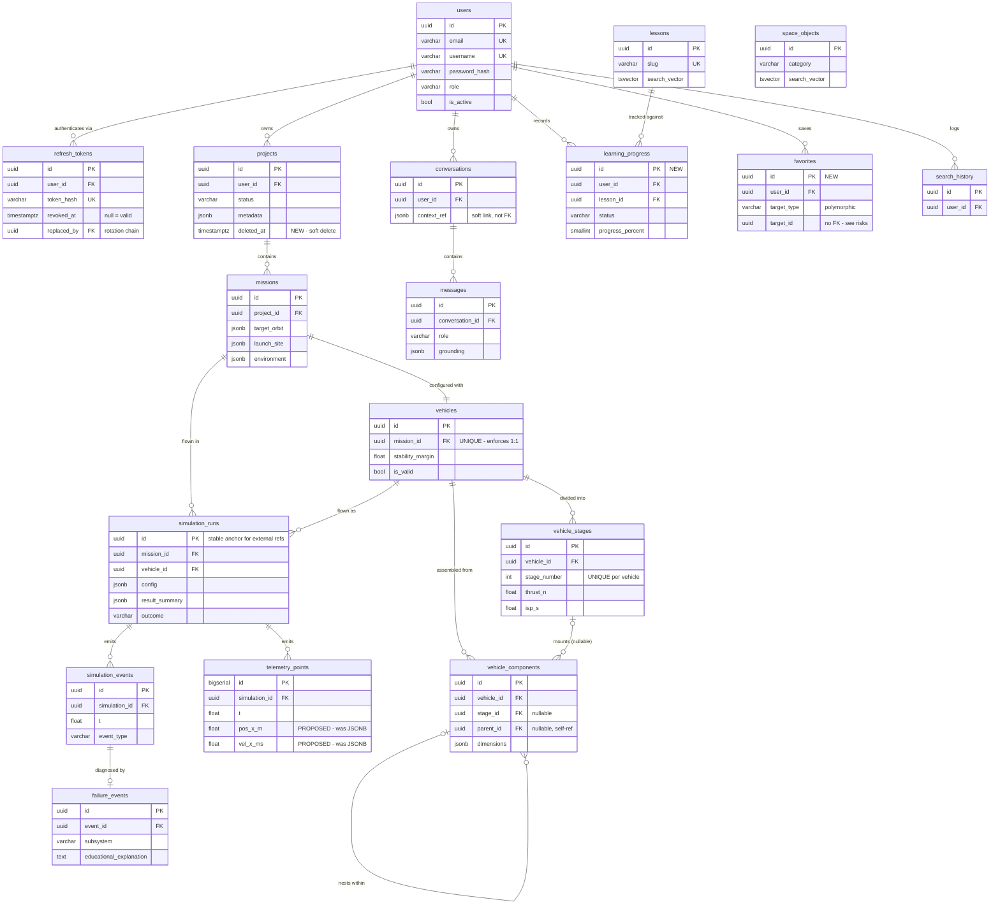

# Database Design — Person 2

**Owner:** Person 2 (Backend / Database / Auth)
**Status:** ⚠ **SUPERSEDED by [`DATABASE_CONTRACT.md`](DATABASE_CONTRACT.md) (Phase 3).** Kept as the exploratory analysis that fed the contract. Where the two disagree, **the contract wins.**
**Date:** 2026-08-19

> **Known corrections since this was written:**
> 1. **Telemetry volume was overstated by 20×.** §8 Risk 2 estimates ~12,000 rows per run from the integrator timestep (`dt=0.05`). `SIMULATION.md` specifies a *persistence* rate of 1 Hz — the real figure is **~600 rows per run**. The recommendation to flatten JSONB still stands, but on type-safety and ergonomics grounds, not scale. See `SCHEMA_DECISIONS.md` SD-5.
> 2. **`favorites` moved from "build now" to DEFER.** No endpoint in `API.md`, no demo act requires it. See SD-3.
> 3. **Stage mass resolved as Option C**, not the Option A leaning in §9 Q3 — Option B double-counts by construction because `component_type` already includes `engine` and `body`. See SD-6.
> 4. **A second over-determination was found** after this document: `thrust_n`/`isp_s`/`burn_time_s`/`propellant_mass_kg` are four authored fields with only three degrees of freedom, and `RKT_SPEC.md`'s example is inconsistent by 2.45×. See SD-7.

## Relationship to `docs/architecture/DATABASE.md`

`docs/architecture/DATABASE.md` remains the **authoritative, team-agreed schema**. This document is the design analysis layered on top of it: which of the 20 requested domains are actually necessary, what changes, and what should be rejected. Once the open questions in §9 are answered, the accepted parts get folded into `DATABASE.md` and become authoritative — this file stays as the reasoning record. Two competing sources of truth would be worse than none, so nothing here is "live" until it lands there.

---

## 1. Final Entity List

The request listed 20 domains. Eleven of them already exist in `DATABASE.md` under an existing name; taking the list literally would add ~9 further tables to a schema that already has 16, most of them unbacked by any endpoint in `API.md` or any moment in `DEMO_RUNBOOK.md`. The recommendation is **2 new tables now, 2 changes to existing tables, 4 deferred, 4 rejected.**

### Tier 1 — Already designed, keep unchanged (14)

These exist in `DATABASE.md` and have contracts depending on them. No changes proposed.

`users` · `refresh_tokens` · `missions` · `vehicles` · `vehicle_stages` · `vehicle_components` · `simulation_runs` · `simulation_events` · `failure_events` · `space_objects` · `lessons` · `search_history` · `conversations` · `messages`

(`projects` and `telemetry_points` are the other two existing tables; both are in Tier 2 because a change is proposed to each.)

### Tier 2 — Build now (2 new tables + 2 changes)

| Entity | Why it earns its place |
|---|---|
| **`learning_progress`** | Explicitly in P2's scope ("Learning progress persistence") and `API.md` already publishes `POST /learning/progress`. There is currently no table behind a documented endpoint — a real gap. |
| **`favorites`** | Cheap (one table, no cascade complexity), directly supports the Explore flow that opens the demo. Lowest-priority of the two; confirm with P1 that the UI wants it before building (§9 Q7). |
| **`projects.deleted_at`** (column) | `DELETE /projects/{id}` currently hard-deletes and cascades through missions → vehicles → simulation_runs → telemetry_points. One click can irreversibly destroy thousands of rows. Soft delete is justified *here specifically* because of cascade depth. |
| **`telemetry_points`** (column types) | Proposed change from JSONB to flat `float8` columns — see §8 Risk 2. Highest-volume table in the system; JSONB per row is the wrong storage choice. Requires P3 agreement. |

### Tier 3 — Deferred (designed, not built)

| Entity | Why not now |
|---|---|
| `project_versions` | The `.rkt` file **is** the versioning and sharing story for MVP (`RKT_SPEC.md`). In-DB version history means snapshotting an entire project→mission→vehicle→stages→components tree. Design sketched in §4.11 for when it's wanted. |
| `rocket_instances` | Blocked on a cardinality decision (§9 Q2), not on effort. Cannot be designed correctly until we know whether a vehicle design is reusable across missions. |
| `quizzes` / `quiz_attempts` | Genuinely useful for an education platform, but **absent from all 8 acts of `DEMO_RUNBOOK.md`**. Time-constrained MVP: build what the demo shows. |
| `learning_paths` | See rejection reasoning below — currently redundant, but the *one* form that would justify it is described in §4.12. |

### Tier 4 — Rejected as separate entities

| Requested | Verdict |
|---|---|
| `rockets`, `rocket_components` | **These already exist as `vehicles` and `vehicle_components`.** "Vehicle" is the entity name in `API.md` (8 endpoints), `RKT_SPEC.md`, `simulation/README.md`'s `SimConfig`, `ARCHITECTURE.md`'s module table, and the `apps/api/src/vehicles/` scaffold. "Rocket" appears only in UI prose. Creating `rockets` would duplicate `vehicles`; renaming would break P1's API calls and P3's config contract, violating "do not casually rename API fields." Recommendation: keep `vehicles` in the schema/API, let the **UI** say "rocket" freely. See §9 Q1. |
| `mission_events` | **These already exist as `simulation_events`.** Events (ignition, max-Q, staging, apogee, failure) are properties of *one simulation run*, not of a mission — a mission can be simulated many times with different event timelines. Attaching them to `missions` would lose that. If what's wanted is a mission *audit log* (created/validated/simulated), that's a different, non-MVP feature. |
| `profiles` | `users` already carries `display_name`, `avatar_url`, `role`. A separate table is justified when profile data grows large/optional, or to isolate auth columns from public-readable ones. Neither applies yet. Merging keeps every profile read from being a join. Revisit if profiles gain many fields. |
| `courses` | Redundant with `learning_paths` — two names for one grouping level. Pick at most one (§9 Q4); currently neither is needed. |

### Known future table, not in the request

`reports` — `API.md` publishes `POST /reports` and `GET /reports/{id}`. Not designed here (out of the requested domains) but it will need a table, and it will reference `simulation_runs.id`. Flagged so it isn't forgotten (§9 Q8).

---

## 2. Relationship Explanation

### 2.1 Ownership spine

Everything user-owned hangs off one chain:

```
users → projects → missions → vehicles → {vehicle_stages, vehicle_components}
                          ↘ simulation_runs → {telemetry_points, simulation_events → failure_events}
```

Authorization walks this chain. Every protected read/write resolves to a `user_id` by joining upward — the backend never trusts a client-supplied owner id. For deep resources this means a join (`telemetry_points → simulation_runs → missions → projects.user_id`); if that becomes a hot path, the fix is a denormalized `user_id` on `simulation_runs`, not weaker checks.

### 2.2 project → vehicle (the requested focus)

There is **no direct FK** from `projects` to `vehicles`, and that's deliberate. The path is `projects → missions → vehicles`. A vehicle exists to fly a mission; a project is the container for one or more missions. Adding `vehicles.project_id` alongside `vehicles.mission_id` would create two paths to the same ownership answer and invite them to disagree.

Cardinality today is **mission 1:1 vehicle** (`vehicles.mission_id` NOT NULL, plus a proposed UNIQUE constraint — see §6, currently only an index, so the "1:1" is documented but not enforced). This matches `GET /missions/{mid}/vehicle` returning a single object.

### 2.3 vehicle → components (the requested focus)

Two overlapping groupings, both legitimate:

- `vehicle_components.vehicle_id` → the component belongs to this vehicle (NOT NULL, hard ownership)
- `vehicle_components.stage_id` → the component is mounted on this stage (**nullable**, `ON DELETE SET NULL`)

Nullable is correct: a nose cone or payload isn't part of any stage, and deleting a stage shouldn't delete a payload that survives staging. `vehicle_components.parent_id` (self-reference) additionally allows assembly nesting — fins attached to a body tube.

**Mass duplication is the live risk here.** `vehicle_stages.dry_mass_kg` and the sum of that stage's `vehicle_components.mass_kg` are two representations of the same physical quantity. If a user edits components, does stage dry mass recompute? Today nothing says. This must be resolved before either is written to (§9 Q3) — it is a correctness bug waiting to happen, not a style question.

### 2.4 mission → project (the requested focus)

`missions.project_id` NOT NULL, `ON DELETE CASCADE`. A mission has no meaning outside its project. Missions are never shared between projects — copying a mission means duplicating the row, which is the right semantics for an educational tool where students fork and tweak designs.

### 2.5 Learning progress (the requested focus)

`learning_progress` is a **join table with state**: one row per (user, lesson) pair the user has actually interacted with.

Design decision: **absence of a row means "not started."** Do not pre-create `not_started` rows for every user × lesson combination — that's a cross product that grows with the catalog and carries no information. The `status` enum still includes `not_started` for rows that regress (a lesson reset), but the common case is no row at all.

Progress attaches to `lessons`, not to any course/path, because `lessons` is the only content entity that exists.

### 2.6 Conversation ownership (the requested focus)

`conversations.user_id` NOT NULL, `ON DELETE CASCADE`. **`messages` deliberately has no `user_id`** — ownership is inherited through `conversation_id`.

The tradeoff: every message authorization check joins `conversations`. The alternative (denormalizing `user_id` onto `messages`) buys a cheaper filter but creates a field that can contradict its parent. Messages are always fetched in conversation context ("load this conversation"), never as a global cross-conversation feed, so the join is on a path that's already happening. Recommendation: **no `user_id` on `messages`.** Revisit only if a "search all my messages" feature appears.

`conversations.context_ref` is a JSONB soft link (`{"type": "simulation_run", "id": "..."}`), not an FK — a conversation can be about a mission, a run, or a lesson, and should survive deletion of whichever it was about. Cost: no referential integrity; the app must tolerate a dangling reference and render it gracefully.

### 2.7 Future simulation result references (the requested focus)

**`simulation_runs.id` is the stable public anchor for anything that refers to "a simulation result."** Reports, AI failure analyses, conversation context, shareable links, and `.rkt` `results_ref` should all reference `simulation_runs.id` and nothing deeper.

`telemetry_points`, `simulation_events`, and `failure_events` are **internal detail of a run.** They are high-volume and high-churn (a schema change to telemetry is likely — §8 Risk 2). If external features start FK-ing directly into `telemetry_points`, every future change to that table becomes a cross-team migration. Rule to hold: *outside the simulation module, reference the run, not its contents.*

The one existing exception is `failure_events.event_id → simulation_events.id`, which is fine — both live inside the simulation result boundary.

---

## 3. ERD



`space_objects` and `search_history` appear without relationship edges to the spine — `space_objects` is a standalone catalog, and `search_history.user_id` is nullable (anonymous search is permitted per `API.md`, where `/search` is "Optional" auth).

---

## 4. Table-by-Table Schema

Existing tables are summarized with only the design commentary that matters; their DDL is in `docs/architecture/DATABASE.md` and is not restated here. **New and changed tables are given in full.**

### 4.1 `users` — unchanged
PK `id` UUID. UNIQUE on `email` and `username`. `password_hash` never leaves the DB layer. `is_active` already provides account deactivation, so no `deleted_at` is proposed — deactivating is the correct semantic for an account, and hard-deleting a user cascades destructively (§8 Risk 4).

### 4.2 `refresh_tokens` — unchanged
Designed in the pre-Phase-2 correction (`DECISION_LOG.md` #16). Stores `token_hash`, never the raw token. Valid ⟺ `revoked_at IS NULL AND expires_at > now()`. `replaced_by` self-FK forms the rotation chain.

### 4.3 `projects` — **one column added**

```sql
ALTER TABLE projects ADD COLUMN deleted_at TIMESTAMPTZ;
CREATE INDEX idx_projects_user_active ON projects(user_id) WHERE deleted_at IS NULL;
```

Soft delete is justified here and nowhere else in the user-data tree, because `DELETE /projects/{id}` cascades through four levels down to `telemetry_points`.

Note the overlap with the existing `status = 'archived'`. These are **different states** and both should exist: `archived` is a user-chosen shelf ("I'm done with this"), `deleted_at` is removal with a recovery window. Every project query must then filter `WHERE deleted_at IS NULL` — a real, permanent cost in discipline, which is why it is not proposed for any other table. `metadata` JSONB stays as-is (genuinely open-ended per-project extras).

### 4.4 `missions` — unchanged
`project_id` NOT NULL CASCADE. Three JSONB columns (`target_orbit`, `launch_site`, `environment`) — justified: shapes vary by mission type and are consumed wholesale by the simulation engine rather than queried field-by-field. If we ever filter missions by launch site, `launch_site.name` should be promoted to a real column.

### 4.5 `vehicles` — unchanged (naming decision pending, §9 Q1)
`mission_id` NOT NULL CASCADE. Should carry a **UNIQUE constraint**, not just an index, to actually enforce the documented 1:1 (§6). `cg_position` / `cp_position` JSONB are fixed-shape `{x,y,z}` and are candidates for flattening, but they are one row per vehicle — the cost is negligible, unlike telemetry. Leave them.

`is_valid` + `validation_errors` are a **cache of a derived result**. They must be invalidated whenever stages/components change, or they will silently go stale and the UI will show a green check on a broken rocket. Recommend recomputing on write rather than trusting the stored flag (§9 Q3 is adjacent).

### 4.6 `vehicle_stages` — unchanged
UNIQUE `(vehicle_id, stage_number)` already specified — good, it prevents two "stage 1"s. Physical-impossibility CHECKs should be added (§6).

### 4.7 `vehicle_components` — unchanged
`stage_id` nullable + `ON DELETE SET NULL`; `parent_id` self-FK nullable. `dimensions` and `properties` JSONB are **the strongest legitimate JSONB case in the schema** — a nose cone has `{length, diameter}`, a fin has `{span, chord}`; modelling that relationally means either a sparse table of every possible dimension or one table per component type.

`parent_id` currently has **no cycle protection** — a component can be made its own ancestor, and a recursive assembly walk would hang (§8 Risk 5).

### 4.8 `simulation_runs` — unchanged
The stable anchor (§2.7). `config` and `result_summary` JSONB are correct: `config` mirrors P3's `SimConfig` shape which P2 must not fossilize into columns, and `result_summary` is a display-oriented rollup.

### 4.9 `telemetry_points` — **column types proposed to change**

Current design stores `position`, `velocity`, `acceleration` as three JSONB objects per row. This is the highest-volume table in the system (§8 Risk 2). Proposed:

```sql
CREATE TABLE telemetry_points (
    id                  BIGSERIAL PRIMARY KEY,
    simulation_id       UUID NOT NULL REFERENCES simulation_runs(id) ON DELETE CASCADE,
    t                   FLOAT NOT NULL,
    pos_x_m             FLOAT NOT NULL,
    pos_y_m             FLOAT NOT NULL,
    pos_z_m             FLOAT NOT NULL,
    vel_x_ms            FLOAT NOT NULL,
    vel_y_ms            FLOAT NOT NULL,
    vel_z_ms            FLOAT NOT NULL,
    acc_x_ms2           FLOAT NOT NULL,
    acc_y_ms2           FLOAT NOT NULL,
    acc_z_ms2           FLOAT NOT NULL,
    altitude_m          FLOAT,
    speed_ms            FLOAT,
    mass_kg             FLOAT,
    thrust_n            FLOAT,
    drag_n              FLOAT,
    dynamic_pressure_pa FLOAT,
    mach_number         FLOAT,
    stage               INT,
    phase               VARCHAR(20)
);
CREATE INDEX idx_telemetry_sim ON telemetry_points(simulation_id, t);
```

Rationale: the vectors are **fixed-shape and always present** — the flexibility JSONB buys is unused, while its per-row key-name overhead is paid on every one of potentially millions of rows. `BIGSERIAL` PK is retained deliberately (cheap sequential insert on the hottest write path; do not "fix" it to UUID for consistency). **Requires P3 agreement** since it changes the shape they emit (§9 Q5).

### 4.10 `simulation_events` / `failure_events` — unchanged
`failure_events.event_id` → `simulation_events.id` CASCADE, 1:1-ish (0..1 failure diagnosis per event). Rich text fields (`educational_explanation`, `recommended_fix`) are AI/authored content — P2 stores, P4 produces.

### 4.11 `learning_progress` — **NEW**

```sql
CREATE TABLE learning_progress (
    id               UUID PRIMARY KEY DEFAULT gen_random_uuid(),
    user_id          UUID NOT NULL REFERENCES users(id) ON DELETE CASCADE,
    lesson_id        UUID NOT NULL REFERENCES lessons(id) ON DELETE CASCADE,
    status           VARCHAR(20) NOT NULL DEFAULT 'in_progress'
                     CHECK (status IN ('not_started','in_progress','completed')),
    progress_percent SMALLINT NOT NULL DEFAULT 0
                     CHECK (progress_percent BETWEEN 0 AND 100),
    last_viewed_at   TIMESTAMPTZ,
    completed_at     TIMESTAMPTZ,
    created_at       TIMESTAMPTZ NOT NULL DEFAULT now(),
    updated_at       TIMESTAMPTZ NOT NULL DEFAULT now(),
    CONSTRAINT uq_progress_user_lesson UNIQUE (user_id, lesson_id),
    CONSTRAINT ck_progress_completed CHECK (
        (status = 'completed') = (completed_at IS NOT NULL)
    )
);
CREATE INDEX idx_progress_user ON learning_progress(user_id, status);
```

The UNIQUE makes `POST /learning/progress` a natural upsert (`ON CONFLICT ... DO UPDATE`), which is what an idempotent progress-tracking endpoint wants. The final CHECK keeps `status` and `completed_at` from disagreeing — a cheap guard against a class of bug that is otherwise invisible until reporting time.

### 4.12 `favorites` — **NEW** (confirm with P1 first)

```sql
CREATE TABLE favorites (
    id          UUID PRIMARY KEY DEFAULT gen_random_uuid(),
    user_id     UUID NOT NULL REFERENCES users(id) ON DELETE CASCADE,
    target_type VARCHAR(20) NOT NULL
                CHECK (target_type IN ('space_object','lesson','project')),
    target_id   UUID NOT NULL,
    created_at  TIMESTAMPTZ NOT NULL DEFAULT now(),
    CONSTRAINT uq_favorite UNIQUE (user_id, target_type, target_id)
);
CREATE INDEX idx_favorites_user ON favorites(user_id, created_at DESC);
```

Polymorphic by `(target_type, target_id)` with **no FK** — the alternative is three near-identical tables. Accepted cost: orphaned rows if a target is deleted. Tolerable because the two common targets (`space_objects`, `lessons`) are seed-managed and rarely deleted, and an orphaned favorite is a cosmetic annoyance, not corruption. Reads must tolerate a missing target. If a fourth target type appears, revisit — the polymorphic approach degrades as types multiply.

### 4.13 `conversations` / `messages` — unchanged
Ownership per §2.6. `messages.grounding` JSONB holds references to the deterministic data an AI answer is based on, enforcing "AI explains, models calculate."

### 4.14 `space_objects` / `lessons` / `search_history` — unchanged
Seed-managed catalogs (content authored by P4 per `DECISION_LOG.md` #18). GIN indexes on `search_vector`. `search_history.user_id` is nullable for anonymous search.

### 4.15 `project_versions` — **deferred design**

If/when in-DB versioning is wanted:

```sql
CREATE TABLE project_versions (
    id             UUID PRIMARY KEY DEFAULT gen_random_uuid(),
    project_id     UUID NOT NULL REFERENCES projects(id) ON DELETE CASCADE,
    version_number INT NOT NULL,
    snapshot       JSONB NOT NULL,   -- full .rkt-shaped payload
    note           TEXT,
    created_by     UUID REFERENCES users(id) ON DELETE SET NULL,
    created_at     TIMESTAMPTZ NOT NULL DEFAULT now(),
    CONSTRAINT uq_project_version UNIQUE (project_id, version_number)
);
```

**JSONB snapshot, not normalized copies.** Versioning a tree by duplicating rows across five tables means every future schema change has to migrate historical versions too. A snapshot in the `.rkt` shape sidesteps that entirely and reuses the format we already validate.

### 4.16 `learning_paths` — **deferred, and only in this form**

Currently redundant: `lessons` already has `category`, `sort_order`, and a `prerequisites` JSONB array — that is a learning path expressed with columns we already have. A `learning_paths` table only earns its place if we need **curated sequences that cross categories** or multiple orderings of the same lesson. That requires `learning_paths` *plus* a `learning_path_lessons` join table (N:M with position) — two tables for a feature nothing has asked for yet.

---

## 5. Index Strategy

**PostgreSQL does not automatically index foreign keys.** Only PKs and UNIQUE constraints get indexes for free. Every FK below is indexed deliberately.

| Index | Table | Purpose |
|---|---|---|
| `idx_users_email` | users | login lookup (also UNIQUE) |
| `idx_refresh_tokens_hash` (UNIQUE) | refresh_tokens | token verification on every refresh |
| `idx_refresh_tokens_user` | refresh_tokens | "revoke all my sessions" |
| `idx_projects_user_active` (partial) | projects | dashboard list; `WHERE deleted_at IS NULL` |
| `idx_missions_project` | missions | project detail page |
| `idx_vehicles_mission` (→ UNIQUE) | vehicles | mission detail; upgrade to UNIQUE to enforce 1:1 |
| `idx_stages_vehicle`, `idx_stages_order` (UNIQUE) | vehicle_stages | builder UI; ordering integrity |
| `idx_components_vehicle` | vehicle_components | builder UI |
| `idx_simruns_mission` | simulation_runs | run history for a mission |
| `idx_telemetry_sim` | telemetry_points | **the critical one** — `(simulation_id, t)` composite serves both "all points for this run" and time-ordered playback |
| `idx_events_sim` | simulation_events | `(simulation_id, t)` event timeline |
| `idx_spaceobj_search`, `idx_lessons_search` | GIN | full-text search |
| `idx_spaceobj_source` (UNIQUE, partial) | space_objects | seed idempotency — makes re-running loaders an upsert |
| `idx_conversations_user` | conversations | `(user_id, updated_at DESC)` conversation list |
| `idx_messages_conversation` | messages | `(conversation_id, created_at)` transcript order |
| `idx_progress_user` | learning_progress | `(user_id, status)` — "my completed lessons" |
| `uq_progress_user_lesson` (UNIQUE) | learning_progress | upsert target |
| `idx_favorites_user` | favorites | `(user_id, created_at DESC)` |
| `idx_searchhist_user` | search_history | `(user_id, created_at DESC)` |

**Deliberately not indexed:**
- **No JSONB GIN indexes yet.** Add only when a real query pattern appears; they are large and slow writes.
- **No index on `favorites.target_id`** — reverse lookups ("who favorited this?") aren't a feature. Add if it becomes one.
- **`telemetry_points` gets exactly one index.** It is write-heavy on the hot path; every additional index taxes every inserted point. If time-range scans across runs ever matter, BRIN on `(simulation_id, t)` is the cheaper answer than a second B-tree.

---

## 6. Constraints

### Enum handling
Use `VARCHAR + CHECK`, **not** PostgreSQL `ENUM` types. Adding a value to a PG enum requires `ALTER TYPE` and is awkward to reverse in a migration; a CHECK constraint is a one-line drop-and-recreate. The existing schema declares enums as comments only — these should become real CHECKs:

| Table | Constraint |
|---|---|
| users | `role IN ('student','educator','admin')` |
| projects | `status IN ('draft','active','completed','archived')` |
| missions | `status IN ('planning','ready','simulated','analyzed')` |
| simulation_runs | `status IN ('pending','running','completed','failed','cancelled')`, `outcome IN ('success','partial','failure')` |
| simulation_events | `severity IN ('info','warning','critical','fatal')` |
| messages | `role IN ('user','assistant','system')` |
| conversations | `context_type IN ('general','tutor','failure_analysis','recommendation')`, `status IN ('active','archived')` |

### Physical-impossibility CHECKs
These belong in the database because they can never legitimately be violated, and "never trust frontend validation" means the last line of defence is here:

```sql
ALTER TABLE vehicle_stages
  ADD CONSTRAINT ck_stage_masses CHECK (dry_mass_kg > 0 AND propellant_mass_kg >= 0),
  ADD CONSTRAINT ck_stage_thrust CHECK (thrust_n > 0),
  ADD CONSTRAINT ck_stage_burn   CHECK (burn_time_s > 0),
  ADD CONSTRAINT ck_stage_number CHECK (stage_number >= 1);
ALTER TABLE vehicle_components
  ADD CONSTRAINT ck_component_mass CHECK (mass_kg >= 0);
```

**Domain-range rules stay in Pydantic, not the DB** — `isp_s BETWEEN 50 AND 500` (`RKT_SPEC.md` rule 5) is an educational plausibility bound, not a law of physics, and is likelier to be tuned. Splitting it this way keeps migrations out of the loop when the team retunes limits.

### Uniqueness
`users.email`, `users.username`, `lessons.slug`, `refresh_tokens.token_hash`, `(vehicle_id, stage_number)`, `(user_id, lesson_id)`, `(user_id, target_type, target_id)`, `(project_id, version_number)`, and `(source, source_id) WHERE source_id IS NOT NULL`.

**Proposed addition:** `vehicles.mission_id` UNIQUE — the 1:1 is documented and assumed by `GET /missions/{mid}/vehicle`, but currently only backed by a non-unique index, so nothing stops two vehicles attaching to one mission.

### FK delete behaviour

| Relationship | Action | Reasoning |
|---|---|---|
| users → refresh_tokens, projects, conversations, learning_progress, favorites, search_history | CASCADE | all meaningless without the user |
| projects → missions → vehicles → stages/components | CASCADE | strict containment |
| simulation_runs → telemetry/events | CASCADE | internal detail of a run |
| simulation_events → failure_events | CASCADE | diagnosis of one event |
| conversations → messages | CASCADE | transcript belongs to conversation |
| vehicle_stages → vehicle_components.stage_id | **SET NULL** | stage-less components (payload, nose) must survive |
| vehicle_components → parent_id | SET NULL | removing an assembly shouldn't delete children |
| project_versions → created_by | SET NULL | keep history if author is removed |
| **simulation_runs.vehicle_id → vehicles** | **RESTRICT (proposed)** | currently defaults to NO ACTION; deleting a vehicle that has recorded runs would orphan or destroy results. Blocking the delete is safer than silently invalidating history. |

### Timestamps
Every table gets `created_at TIMESTAMPTZ NOT NULL DEFAULT now()`. Mutable tables also get `updated_at`. **`TIMESTAMPTZ` everywhere, never `TIMESTAMP`** — mixed timezone handling in a launch-time/telemetry app is a genuine correctness hazard. `updated_at` should be maintained by SQLAlchemy's `onupdate` rather than a DB trigger — one mechanism, visible in the model, no hidden behaviour.

---

## 7. Migration Strategy

Alembic, per `DECISION_LOG.md` #5 and `database/README.md`. One revision per logical group, never edit a released migration.

**Ordering** (each revision must apply cleanly to a fresh DB, so FK targets come first):

1. **Baseline + extensions** — empty revision that enables `pgcrypto` (or `uuid-ossp`) for `gen_random_uuid()`. Every table depends on this; it must be revision one.
2. **`users` + `refresh_tokens`** — the auth pair; the token table is meaningless alone.
3. **`projects`** (including `deleted_at`) → **`missions`** → **`vehicles`** → **`vehicle_stages`** → **`vehicle_components`** — strict FK order.
4. **`simulation_runs`** → **`telemetry_points`**, **`simulation_events`** → **`failure_events`**.
5. **`space_objects`**, **`lessons`**, **`search_history`** — independent catalogs, can land any time after `users`.
6. **`learning_progress`** — needs both `users` and `lessons`.
7. **`favorites`** — needs `users`.
8. **`conversations`** → **`messages`**.

**Driver split:** the app runs on `asyncpg`; Alembic runs on `psycopg2`. This is the standard pattern for async SQLAlchemy and is **intentional** — it must be commented in `database/migrations/env.py` so nobody "fixes" it into one driver (`KNOWN_ISSUES.md` §5 D-5).

**Autogenerate is a draft, not an answer.** Alembic's autogenerate does not reliably detect CHECK constraints, partial indexes, index renames, or server defaults. Every generated revision gets read and hand-corrected before commit.

**`tsvector` maintenance** is not expressible via models — `search_vector` population needs either a generated column or a trigger, written as raw SQL in the migration that creates `space_objects` / `lessons`.

Each migration must be tested by `upgrade head` on a **fresh** database and then `downgrade` one step, before commit.

---

## 8. Risks

**Risk 1 — `rockets` vs `vehicles` naming split (highest, non-technical).**
If the schema adopts "rocket" while `API.md`, `RKT_SPEC.md`, `SimConfig`, and the module scaffold all say "vehicle," the codebase ends up translating between two names for one concept at every layer, forever. Every such translation is a place to introduce a bug. **Mitigation:** decide once, in writing, before any model is created (§9 Q1). Recommendation: keep `vehicle` in schema and API; let the UI say "rocket."

**Risk 2 — `telemetry_points` volume and row width.**
At `dt_powered_s = 0.05` over a `max_time_s = 600` run (`RKT_SPEC.md` defaults), a single simulation can emit **up to ~12,000 rows**. A demo session with 100 runs approaches ~1.2M rows — untroubling for Postgres in itself, but the current design stores three JSONB objects per row, paying key-name overhead a million times over for a fixed `{x,y,z}` shape. **Mitigation:** flatten to `float8` columns (§4.9), and decide a retention policy (§9 Q6). If persistence still hurts, the next lever is storing a downsampled series for playback plus the full series only on demand — but measure before optimizing further.

**Risk 3 — derived data going stale.**
`vehicles.is_valid`, `vehicles.validation_errors`, `vehicles.total_mass_kg`, `stability_margin` are all cached derivations of stages/components. Any write path that edits a component without recomputing them leaves the UI confidently displaying a wrong answer. **Mitigation:** recompute in one service function that every mutation route calls; never let a route write a component directly.

**Risk 4 — cascade blast radius.**
Deleting one user cascades users → projects → missions → vehicles → simulation_runs → telemetry_points, potentially a multi-million-row transaction that locks and runs long. **Mitigation:** users are deactivated (`is_active`), never hard-deleted, in normal operation; any real purge runs as a background batch job, not inside a request.

**Risk 5 — unbounded recursion in `vehicle_components.parent_id`.**
Nothing prevents a cycle (A parent of B, B parent of A). A recursive assembly traversal would hang. **Mitigation:** enforce acyclicity in the service layer on write (cheapest), and use `WITH RECURSIVE ... CYCLE` detection on read.

**Risk 6 — polymorphic references without integrity.**
`favorites.(target_type,target_id)` and `conversations.context_ref` can both dangle. **Mitigation:** accepted deliberately (§4.12, §2.6); all readers must handle a missing target rather than assuming presence.

**Risk 7 — seed/loader coupling to P4.**
`database/seeds/` loaders (P2) read content shaped by P4 (`DECISION_LOG.md` #18). A content-shape change breaks loading. **Mitigation:** the `(source, source_id)` unique index makes loads idempotent upserts; validate content against a schema at load time and fail loudly rather than half-importing.

**Risk 8 — scope creep back toward the rejected tables.**
Quizzes, courses, paths, versions, and profiles are each individually reasonable and collectively a second project. **Mitigation:** this document is the record of *why* each was deferred; reopening one requires answering "which demo act needs it?"

---

## 9. Questions That Must Be Resolved Before Implementation

Ordered by how much they block.

**Q1 — `rockets` or `vehicles`? (BLOCKING — affects P1, P3, and every contract)**
The requested domain list says `rockets`/`rocket_components`; every existing contract says `vehicles`/`vehicle_components`. These are the same entity. Recommendation: **keep `vehicles`** in schema and API, use "rocket" freely in UI copy. Needs an explicit yes/no before any model is written — a rename after P1 has written API calls is expensive.

**Q2 — Is mission → vehicle permanently 1:1? (BLOCKS `rocket_instances`)**
Today one vehicle belongs to one mission. Should a student be able to design a rocket once and fly it in several missions? If yes, `vehicles` becomes project-owned and a join entity binds it to missions — a real change to `API.md`. Recommendation for MVP: **keep 1:1**; implement "reuse" as a duplicate-into-new-mission copy, which needs no new entity.

**Q3 — Is stage mass authored or derived? (correctness, blocks builder)**
`vehicle_stages.dry_mass_kg` vs the sum of that stage's `vehicle_components.mass_kg`. Which wins when they disagree? Options: (a) components are authoritative, stage mass is derived and read-only; (b) stage mass is authored, components are cosmetic/3D-only. This determines what the builder writes and what the simulation reads. **Must be answered with P3.**

**Q4 — Learning content depth: lessons only, or lessons + one grouping level?**
Recommendation: **lessons only** for MVP (`category` + `sort_order` + `prerequisites` already sequence them). Confirm with P4, who authors the content, that no cross-category curated path is planned.

**Q5 — Can `telemetry_points` use flat float columns? (needs P3)**
Does the simulation engine emit fixed `{x,y,z}` vectors for position/velocity/acceleration in every case, or can the shape vary (e.g. quaternions later, 6-DOF)? If fixed, flatten (§4.9). If it may vary, JSONB stays and we accept the cost.

**Q6 — Telemetry retention?**
Keep every point of every run forever, or keep the last N runs per mission / downsample after a period? This decides whether the demo database stays small and whether a cleanup job is needed. Cheap to decide now, expensive to retrofit.

**Q7 — Does the frontend actually want `favorites`?**
Not in any demo act. One table, low cost — but no point building an endpoint nobody calls. **Confirm with P1**; if unwanted, drop it from Tier 2 and the design shrinks to a single new table.

**Q8 — What does `reports` (`API.md`) actually persist?**
A generated artifact (PDF/HTML blob or file path), or just parameters to re-render on demand? Out of scope for this design, but it will reference `simulation_runs.id` and needs a table before Phase 4.

**Q9 — Are projects ever shared or public?**
Everything above assumes strict single-owner. Sharing (public read links, educator viewing student work — note `users.role` already includes `educator`) would require a permissions/collaborator model that is far cheaper to design now than to retrofit after every query has a hardcoded `user_id =` filter.

**Q10 — Will P4 need `pgvector`?**
`DECISION_LOG.md` lists semantic search as unresolved (owner P4). If pgvector is likely, enabling the extension in the baseline migration now is nearly free; adding it later to a deployed database is a coordination event.
